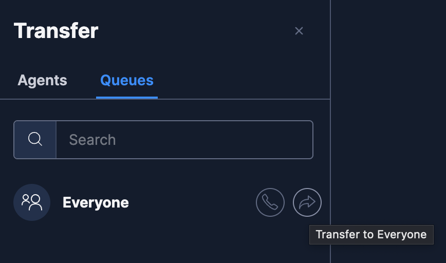

# Twilio Flex Conversations Transfer Interaction Plugin

## Disclaimer

**This software is to be considered "sample code", a Type B Deliverable, and is delivered "as-is" to the user. Twilio bears no responsibility to support the use or implementation of this software.**

## Important note

To use this plugin you need to have Flex Conversations enabled on your account as well as Flex UI 2.0. Please read our doc for more details about it: https://www.twilio.com/docs/flex/developer/conversations

## Information about the plugin

This plugin adds a forward button in the chat in order to make a transfer either to an agent or a queue. It only has the capability of doing "cold" transfers.




## Setup

### Twilio Serverless Functions

This plugin includes a service used to park/unpark/close the interactions using Twilio Functions. Make sure you have the [Twilio Serverless Toolkit](https://www.twilio.com/docs/labs/serverless-toolkit/getting-started) installed before proceding.

- After installing it correctly, follow the procedure below:

```bash
cd serverless-transfer-interaction
```

```bash
cp .env.example .env
```

- Fill the Workspace SID in the `.env` file, obtainable in the console under TaskRouter > Workspaces. Starts with WSxxxx.

- Run

```bash
twilio serverless:deploy
```

### Plugin

- First install the dependencies in the plugin's folder and create the `.env` file:

```bash
# If you are inside the serverless folder, first run: cd ..
cd plugin-transfer-interaction

# If you use npm
npm install

# Create the .env according to the example
cp .env.example .env
```

- Fill the `.env` file with the URL of your Twilio functions created earlier `/transfer-interaction`.

- Inside the `/public` folder, create a `appConfig.js` file according to the `appConfig.example.js` file.

- Finally, to deploy the plugin, run:

```bash
twilio flex:plugins:deploy --changelog "WRITE YOUR CHANGELOG HERE"
```

- You can also run the plugin locally for testing purposes:

```bash
twilio flex:plugins:start
```

### Kudos

Special thanks to [Aymen Naim](https://github.com/aymenn) for the thoughtful insights and assist on building this plugin.
